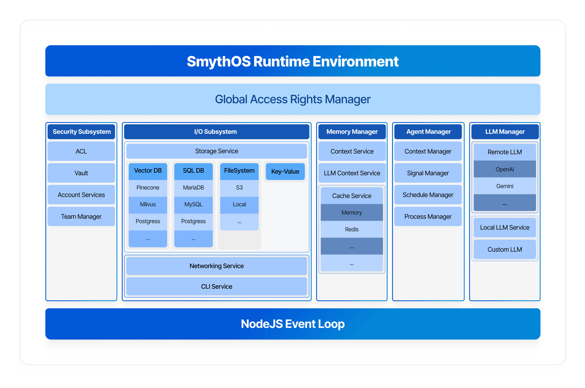

# SmythOS - The Operating System for Agentic AI

Welcome to **SmythOS**, a framework designed to be the operating system for Agentic AI. This monorepo contains the SmythOS ecosystem, providing the tools you need to build, deploy, and manage intelligent AI agents at scale.

## Why SmythOS exists

Building production-ready AI agents is harder than it should be. You end up wrestling with infrastructure instead of focusing on intelligence. Different providers have different APIs, security becomes an afterthought, and scaling from prototype to production means rewriting everything.

SmythOS solves this by providing a complete **Operating System for Agentic AI**. Just as traditional operating systems manage resources and provide APIs for applications, SmythOS manages AI resources and provides a unified SDK that works from development to production.

## Design Principles

SmythOS is designed with a philosophy inspired by operating system kernels, ensuring a robust and scalable foundation for AI agents.



### Unified Resource Abstraction

SmythOS provides a **unified interface for all resources**, ensuring consistency and simplicity across your entire AI platform. Whether you're storing a file locally, on S3, or any other storage provider, you don't need to worry about the underlying implementation details. SmythOS offers a powerful abstraction layer where all providers expose the same functions and APIs.

This principle applies to **all services** - not just storage. Whether you're working with VectorDBs, cache (Redis, RAM), LLMs (OpenAI, Anthropic), or any other resource, the interface remains consistent across providers.

This approach makes your AI platform **easy to scale** and incredibly flexible. You can seamlessly swap between different providers to test performance, optimize costs, or meet specific requirements without changing a single line of your business logic.

### Core Design Principles

### Why Switch to SmythOS?

The current landscape of AI agent development is fragmented and complex. Here's how SmythOS solves the pain points developers face daily:

| **Challenge**             | **Typical Approach**                                                                                        | **SmythOS Solution**                                                                                                                                       |
| ------------------------- | ----------------------------------------------------------------------------------------------------------- | ---------------------------------------------------------------------------------------------------------------------------------------------------------- |
| **Provider Integration**  | Install separate packages for each provider<br/>(`npm install openai anthropic google-cloud-aiplatform...`) | **9+ LLM providers built-in**<br/>180+ models ready out-of-the-box<br/>No additional installations needed, just bring your API keys and you're ready to go |
| **API Consistency**       | Each provider has different APIs<br/>Constant refactoring when switching                                    | **Unified interface for all resources**<br/>Same code works across OpenAI, Anthropic, Google AI, Groq, etc.                                                |
| **Vector Database**       | Manual setup and integration<br/>Different SDKs for each database                                           | **Built-in VectorDB support**<br/>Pinecone, RAMVec, Milvus ... with unified API                                                                            |
| **Data Storage**          | Manual file system handling<br/>Cloud provider-specific code                                                | **Universal storage abstraction**<br/>Local, S3... with same interface                                                                                     |
| **Caching**               | Implement your own caching layer<br/>Redis setup and management                                             | **Built-in cache providers**<br/>RAM, Redis... with automatic management                                                                                   |
| **Security & Access**     | Custom authentication logic<br/>Manual permission systems                                                   | **Enterprise-grade security built-in**<br/>Candidate/ACL system for resource access control                                                                |
| **Credential Management** | Environment variables and manual key handling<br/>Security risks and complexity                             | **Integrated vault system**<br/>HashiCorp Vault, AWS Secrets Manager, local file with/out encryption ... Store your secrets in a secure way                |
| **Data Isolation**        | Manual agent scoping<br/>Risk of data leakage between agents                                                | **Agent-scoped data isolation**<br/>Automatic agent/team-level data boundaries                                                                             |
| **Development Workflow**  | Code-only development<br/>No visual workflow tools                                                          | **Visual + Code workflows**<br/>Build agents visually (.smyth) or pure code                                                                                |
| **Production Scaling**    | Rewrite code for production<br/>Different configurations                                                    | **Dev-to-prod consistency**<br/>Same code, different connectors automatically                                                                              |
| **Account Management**    | Build custom user systems<br/>Authentication from scratch                                                   | **Built-in account management**<br/>Ready integration with existing auth systems                                                                           |

**Key Benefits:**

-   🤖 **Agent-First Design**: Built specifically for AI agent workloads
-   🔧 **Developer-Friendly**: Simple SDK that scales from development to production
-   🧩 **Modular Architecture**: Extensible connector system for any infrastructure
-   ⚡ **Production-Ready**: Scalable, observable, and battle-tested
-   🔒 **Enterprise Security**: Built-in access control and secure credential management

## 🚀 Quick Start

### Method 1: Using the CLI (Recommended)

Install the CLI globally and create a new project:

```bash
npm i -g @smythos/cli
sre create
```

The CLI will guide you step-by-step to create your SDK project with the right configuration for your needs.

### Method 2: Direct SDK Installation

Add the SDK directly to your existing project:

```bash
npm install @smythos/sdk
```

Check the [Examples](packages/examples) and documentation to get started.

---

## Repository Structure

This monorepo contains three main packages:

### SRE (Smyth Runtime Environment) - `packages/core`

The **SRE** is the core runtime environment that powers SmythOS. Think of it as the kernel of the AI agent operating system.

**Features:**

-   **🔌 Modular Architecture**: Pluggable connectors for every service (Storage, LLM, VectorDB, Cache, etc.)
-   **🛡️ Security-First**: Built-in Candidate/ACL system for secure resource access
-   **📊 Resource Management**: Intelligent memory, storage, and compute management
-   **🔄 Agent Orchestration**: Complete agent lifecycle management
-   **🧩 40+ Components**: Production-ready components for AI, data processing, and integrations

**Supported Connectors:**

-   **Storage**: Local, S3, Google Cloud, Azure
-   **LLM**: OpenAI, Anthropic, Google AI, AWS Bedrock, Groq, Perplexity
-   **VectorDB**: Pinecone, Chroma, SmythManaged
-   **Cache**: RAM, Redis, Memcached
-   **Vault**: HashiCorp Vault, AWS Secrets Manager, JSON File

### SDK - `packages/sdk`

The **SDK** provides a clean, developer-friendly abstraction layer over the SRE runtime. It's designed for simplicity without sacrificing power.

**Why Use the SDK:**

-   ✅ **Simple API**: Clean, intuitive interface that's easy to learn
-   🔧 **Type-Safe**: Full TypeScript support with IntelliSense
-   🚀 **Production-Ready**: Same code works in development and production
-   📈 **Configuration-Independent**: Business logic stays unchanged as infrastructure scales

### CLI - `packages/cli`

The **SRE CLI** helps you get started quickly with scaffolding and project management.

## Code examples

The SDK allows you to build agents with code or load and run a .smyth file.
.smyth is the extension of agents built with our SmythOS builder.

## Example 1 : load and run an agent from .smyth file

```typescript
async function main() {
    const agentPath = path.resolve(__dirname, 'my-agent.smyth');

    //Importing the agent workflow
    const agent = Agent.import(agentPath, {
        model: Model.OpenAI('gpt-4o'),
    });

    //query the agent and get the full response
    const result = await agent.prompt('Hello, how are you ?');

    console.log(result);
}
```

Want stream mode ? easy

<details>
<summary>👆 <strong>Click to expand:</strong> Stream Mode Example - Real-time response streaming with events</summary>

```typescript
    const events = await agent.prompt('Hello, how are you ?').stream();
    events.on('content', (text) => {
        console.log('content');
    });

    events.on('end', /*... handle end ... */)
    events.on('usage', /*... collect agent usage data ... */)
    events.on('toolCall', /*... ... */)
    events.on('toolResult', /*... ... */)
    ...

```

</details>

Want chat mode ? easy

<details>
<summary>👆 <strong>Click to expand:</strong> Chat Mode Example - Conversational agent with memory</summary>

```typescript
    const chat = agent.chat();

    //from there you can use the prompt or prompt.stream to handle it

    let result = await chat.prompt("Hello, I'm Smyth")
    console.log(result);

    result = await chat.prompt('Do you remember my name ?");
    console.log(result);


    //the difference between agent.prompt() and chat.prompt() is that the later remembers the conversation
```

</details>

## Example 2 : Article Writer Agent

In this example we are coding the agent logic with the help of the SDK elements.

<details>
<summary>👆 <strong>Click to expand:</strong> Complete Article Writer Agent - Full example using LLM + VectorDB + Storage</summary>

```typescript
import { Agent, Model } from '@smythos/sdk';

async function main() {
    // Create an intelligent agent
    const agent = new Agent({
        name: 'Article Writer',
        model: 'gpt-4o',
        behavior: 'You are a copy writing assistant. The user will provide a topic and you have to write an article about it and store it.',
    });

    // Add a custom skill that combines multiple AI capabilities
    agent.addSkill({
        id: 'AgentWriter_001',
        name: 'WriteAndStoreArticle',
        description: 'Writes an article about a given topic and stores it',
        process: async ({ topic }) => {
            // VectorDB - Search for relevant context
            const vec = agent.vectordb.Pinecone({
                namespace: 'myNameSpace',
                indexName: 'demo-vec',
                pineconeApiKey: process.env.PINECONE_API_KEY,
                embeddings: Model.OpenAI('text-embedding-3-large'),
            });

            const searchResult = await vec.search(topic, {
                topK: 10,
                includeMetadata: true,
            });
            const context = searchResult.map((e) => e?.metadata?.text).join('\n');

            // LLM - Generate the article
            const llm = agent.llm.OpenAI('gpt-4o-mini');
            const result = await llm.prompt(`Write an article about ${topic} using the following context: ${context}`);

            // Storage - Save the article
            const storage = agent.storage.S3();
            const uri = await storage.write('article.txt', result);

            return `The article has been generated and stored. Internal URI: ${uri}`;
        },
    });

    // Use the agent
    const result = await agent.prompt('Write an article about Sakura trees');
    console.log(result);
}

main().catch(console.error);
```

</details>

## 🏗️ Architecture Highlights

### 🔒 Built-in Security

Security is a core tenant of SRE. Every operation requires proper authorization through the **Candidate/ACL system**, ensuring that agents only
access resources they are permitted to.

```typescript
const candidate = AccessCandidate.agent(agentId);
const storage = ConnectorService.getStorageConnector().user(candidate);
await storage.write('data.json', content);
```

### 🔄 Development to Production Evolution

Your business logic stays identical while infrastructure scales:
When you use the SDK, SmythOS Runtime Environment will be implicitly initialized with general connectors that covers standard agent use cases.

<details>
<summary>👆 <strong>Click to expand:</strong> Basic SRE Setup - Default development configuration</summary>

```typescript
// you don't need to explicitly initialize SRE
// we are just showing you how it is initialized internally
// const sre = SRE.init({
//     Cache: { Connector: 'RAM' },
//     Storage: { Connector: 'Local' },
//     Log: { Connector: 'ConsoleLog' },
// });

async function main() {
    // your agent logic goes here
}

main();
```

</details>

But you can explicitly initialize SRE with other built-in connectors, or make your own
Use cases :

-   You want to use a custom agents store
-   You want to store your API keys and other credentials in a more secure vault
-   You need enterprise grade security and data isolation
-   ...

<details>
<summary>👆 <strong>Click to expand:</strong> Production SRE Setup - Enterprise-grade configuration with custom connectors</summary>

```typescript
const sre = SRE.init({
    Account: { Connector: 'EnterpriseAccountConnector', Settings: { ... } },
    Vault: { Connector: 'Hashicorp', Settings: { url: 'https://vault.company.com' } },
    Cache: { Connector: 'Redis', Settings: { url: 'redis://prod-cluster' } },
    Storage: { Connector: 'S3', Settings: { bucket: 'company-ai-agents' } },
    VectorDB: { Connector: 'Pinecone', Settings: { indexName: 'company-ai-agents' } },
    Log: { Connector: 'CustomLogStore'},
});


async function main() {
    // your agent logic goes here
}

main();

```

</details>

### 🧩 Component System

40+ production-ready components for every AI use case.
These components can be invoked programmatically or through the symbolic representation of the agent workflow (the .smyth file).

-   **🤖 AI/LLM**: `GenAILLM`, `VisionLLM`, `MultimodalLLM`, `LLMAssistant`
-   **🌐 External**: `APICall`, `WebSearch`, `WebScrape`, `ZapierAction`
-   **📊 Data**: `DataSourceIndexer`, `DataSourceLookup`, `JSONFilter`
-   **🔧 Logic**: `LogicAND`, `LogicOR`, `Classifier`, `ForEach`
-   **💾 Storage**: `FileStore`, `Code`, `ServerlessCode`

## 🌟 Key Features

| Feature                  | Description                                            |
| ------------------------ | ------------------------------------------------------ |
| **🎯 Agent-Centric**     | Built specifically for AI agent workloads and patterns |
| **🔒 Secure by Default** | Enterprise-grade security with data isolation          |
| **⚡ High Performance**  | Optimized for high-throughput AI operations            |
| **🧩 Modular**           | Swap any component without breaking your system        |
| **📊 Observable**        | Built-in monitoring, logging, and debugging tools      |
| **🌍 Cloud-Native**      | Runs anywhere - local, cloud, edge, or hybrid          |
| **🔄 Scalable**          | From development to enterprise production              |

## 📚 Documentation

-   **[Complete Overview](packages/core/doc/overview.md)** - Deep dive into SRE architecture
-   **[SDK Documentation](packages/sdk/README.md)** - SDK API reference and examples
-   **[Component Library](packages/core/doc/components/)** - All available components

## 🤝 Contributing

We welcome contributions! Please see our [Contributing Guide](CONTRIBUTING.md) and [Code of Conduct](CODE_OF_CONDUCT.md).

## 📄 License

This project is licensed under the [MIT License](LICENSE).

## 🔮 What's Next?

Join our [community](https://discord.gg/smythos) to stay updated on new features, connectors, and capabilities.

---

**Ready to build the next generation of AI agents?** Start with SmythOS and focus on what matters - the intelligence, not the infrastructure.
