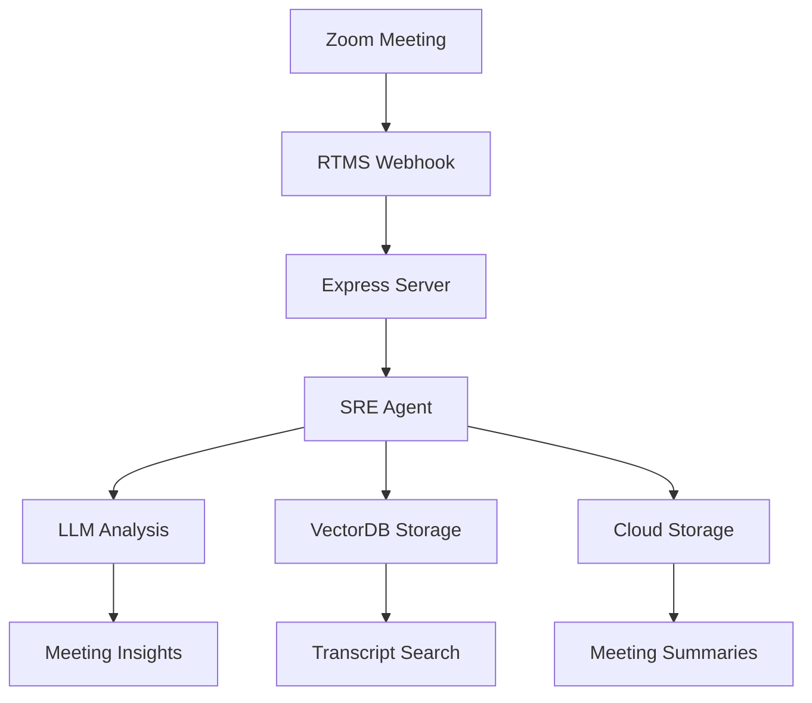

# Zoom RTMS + SmythOS SRE Integration

This example demonstrates how to integrate **Zoom's Real-Time Media Streaming (RTMS)** with **SmythOS SRE** to create intelligent meeting analysis agents that process live meeting data in real-time.

## Features

- **Real-time Transcript Processing**: Captures and analyzes Zoom meeting transcripts as they happen
- **AI-Powered Analysis**: Uses SRE agents to extract insights, action items, and key decisions
- **Vector Database Integration**: Stores transcript segments for semantic search (Pinecone)
- **Cloud Storage**: Saves meeting summaries and data to AWS S3
- **Meeting Intelligence**: Generates comprehensive meeting summaries and insights
- **Scalable Architecture**: Built on SmythOS SRE for enterprise-grade performance

## Three Implementation Options

This example provides three implementation approaches:

### 1. JavaScript Version (`index.js`) - **Recommended**
- **No TypeScript Issues**: Pure JavaScript implementation that runs immediately
- **SRE Integration Ready**: Placeholder structure for easy SRE SDK integration
- **Complete RTMS Integration**: Full Zoom WebSocket and webhook handling
- **Zero Configuration**: Works with just `npm start`
- **Production Ready**: Can be easily extended with real SRE functionality

### 2. TypeScript Version (`index.ts`)
- **Complete AI Agent Integration**: Uses SmythOS SRE agents for advanced transcript analysis
- **VectorDB Support**: Semantic search and indexing with Pinecone
- **Cloud Storage**: AWS S3 integration for persistent data storage
- **Advanced Analytics**: Sophisticated sentiment analysis, action item extraction, and decision tracking
- **Requires**: SmythOS SRE SDK and additional API keys (may have dependency issues)

### 3. Simple Example (`simple-example.ts`)
- **Basic Transcript Processing**: Simple keyword-based analysis without external AI dependencies
- **Lightweight**: Only requires Node.js, Express, and WebSocket libraries
- **Easy to Understand**: Clear demonstration of Zoom RTMS integration patterns
- **No External APIs**: Works without OpenAI, Anthropic, Pinecone, or AWS credentials
- **Perfect for**: Learning, testing, and basic transcript capture

## Architecture



## Quick Start

### Prerequisites

1. **Zoom App**: Create a Zoom app with RTMS permissions in the [Zoom Marketplace](https://marketplace.zoom.us/)
2. **Node.js**: Version 18 or higher
3. **API Keys**: OpenAI or Anthropic for AI analysis
4. **Optional**: Pinecone for vector search, AWS S3 for storage

### Installation

1. **Clone and navigate to the example**:
   ```bash
   cd sre/examples/11-zoom-rtms-integration
   ```

2. **Install dependencies**:
   ```bash
   npm install
   ```

3. **Configure environment**:
   ```bash
   cp env.example .env
   # Edit .env with your credentials
   ```

4. **Start the server**:
   ```bash
   # JavaScript version (recommended - no TypeScript issues)
   npm start
   
   # TypeScript version with full SRE integration
   npm run ts
   
   # Simple example without SRE dependencies
   npm run simple
   ```

### Environment Configuration

Copy `env.example` to `.env` and configure:

```env
# Required - Zoom RTMS Configuration
ZOOM_CLIENT_ID=your_zoom_client_id
ZOOM_CLIENT_SECRET=your_zoom_client_secret
ZOOM_SECRET_TOKEN=your_zoom_secret_token

# Required - AI Model (choose one)
OPENAI_API_KEY=your_openai_api_key
# OR
ANTHROPIC_API_KEY=your_anthropic_api_key

# Optional - VectorDB for transcript search
PINECONE_API_KEY=your_pinecone_api_key
PINECONE_INDEX_NAME=zoom-meetings

# Optional - Storage for meeting data
AWS_ACCESS_KEY_ID=your_aws_access_key
AWS_SECRET_ACCESS_KEY=your_aws_secret_key
AWS_S3_BUCKET=zoom-meeting-data
```

## Zoom App Setup

### 1. Create Zoom App

1. Go to [Zoom Marketplace](https://marketplace.zoom.us/)
2. Create a new **General App** → **User-Managed**
3. Configure basic information

### 2. Configure RTMS Permissions

**Scopes Required**:
- `meeting:read`
- `meeting:write`
- `rtms:read`
- `rtms:write`

**Event Subscriptions**:
- `meeting.rtms_started`
- `meeting.rtms_stopped`
- `endpoint.url_validation`

### 3. Webhook Configuration

Set your webhook endpoint URL to:
```bash
https://your-domain.com/webhook
```

For local development, use [ngrok](https://ngrok.com/):
```bash
ngrok http 3000
# Use the HTTPS URL: https://abc123.ngrok.io/webhook
```

## SRE Agent Capabilities

The integration creates intelligent agents with these skills:

### 1. Real-time Transcript Analysis
- Extracts key topics and themes
- Identifies action items and decisions
- Analyzes participant sentiment
- Tracks important questions

### 2. Meeting Summarization
- Generates comprehensive meeting summaries
- Identifies next steps and follow-ups
- Highlights key decisions and outcomes
- Provides participant insights

### 3. Vector Search Integration
- Indexes transcript segments for semantic search
- Enables finding specific topics across meetings
- Supports historical meeting analysis

### 4. Intelligent Storage
- Saves meeting data to cloud storage
- Organizes by meeting ID and timestamp
- Preserves analysis results and summaries

## Usage Examples

### Basic Meeting Analysis

When a Zoom meeting starts with RTMS enabled:

1. **Webhook Triggered**: Server receives `meeting.rtms_started`
2. **Agent Created**: SRE agent is instantiated for the meeting
3. **WebSocket Connection**: Connects to Zoom's media stream
4. **Real-time Processing**: Transcripts are analyzed as they arrive
5. **Insights Generated**: Key information is extracted and stored

### Example Output

```json
{
  "speaker": "John Doe",
  "timestamp": "2024-01-15T10:30:00Z",
  "transcript": "Let's schedule a follow-up meeting for next Tuesday to review the project proposal",
  "analysis": {
    "topics": ["meeting scheduling", "project review"],
    "actionItems": ["Schedule follow-up meeting for Tuesday"],
    "decisions": [],
    "questions": [],
    "sentiment": "positive"
  }
}
```

### Meeting Summary

```markdown
# Meeting Summary - Project Review Call

## Overview
Team discussion about Q1 project proposal and next steps.

## Key Decisions
- Approved budget increase for additional resources
- Selected vendor for cloud infrastructure

## Action Items
- [ ] John: Schedule follow-up meeting for Tuesday
- [ ] Sarah: Prepare vendor contract by Friday
- [ ] Team: Review technical specifications

## Next Steps
- Technical review session scheduled for next week
- Final approval expected by month-end
```

## API Endpoints

### Health Check
```http
GET /health
```
Returns server status and active meeting count.

### Webhook Endpoint
```http
POST /webhook
```
Receives Zoom RTMS events and processes meeting data.

## Advanced Configuration

### Custom SRE Configuration

You can customize the SRE initialization for production:

```typescript
import { SRE } from '@smythos/sre';

// Custom SRE setup for enterprise
SRE.init({
    Storage: { 
        Connector: 'S3', 
        Settings: { bucket: 'enterprise-meetings' } 
    },
    VectorDB: { 
        Connector: 'Pinecone', 
        Settings: { indexName: 'company-meetings' } 
    },
    Cache: { 
        Connector: 'Redis', 
        Settings: { url: 'redis://prod-cluster' } 
    }
});
```

### Custom Agent Behaviors

Modify the agent behavior for specific use cases:

```typescript
const agent = new Agent({
    name: 'Sales Meeting Assistant',
    behavior: `You are a sales meeting specialist. Focus on:
    - Lead qualification insights
    - Deal progression indicators  
    - Customer objections and responses
    - Follow-up opportunities`,
    model: 'gpt-4o'
});
```

## Monitoring and Debugging

### Logging

Set `LOG_LEVEL=debug` for detailed logs:

```bash
LOG_LEVEL=debug npm start
```

### Health Monitoring

Check active meetings and agents:

```bash
curl http://localhost:3000/health
```

Response:
```json
{
  "status": "healthy",
  "activeMeetings": 2,
  "activeAgents": 2,
  "timestamp": "2024-01-15T10:30:00Z"
}
```

## Troubleshooting

### Common Issues

1. **No Transcript Data**:
   - Verify RTMS is enabled in Zoom settings
   - Check webhook URL is accessible
   - Ensure proper scopes are configured

2. **Agent Creation Fails**:
   - Verify AI API keys (OpenAI/Anthropic)
   - Check SRE initialization
   - Review log output for errors

3. **Storage Issues**:
   - Verify AWS credentials and permissions
   - Check S3 bucket exists and is accessible
   - Ensure proper IAM policies

4. **VectorDB Problems**:
   - Verify Pinecone API key and index name
   - Check index dimensions match embedding model
   - Ensure sufficient Pinecone quota

### Debug Commands

```bash
# Test webhook endpoint
curl -X POST http://localhost:3000/webhook \
  -H "Content-Type: application/json" \
  -d '{"event": "endpoint.url_validation", "payload": {"plainToken": "test"}}'

# Check server health
curl http://localhost:3000/health
```

## Security Considerations

- Store sensitive credentials in environment variables
- Use HTTPS for webhook endpoints in production
- Implement proper authentication for API endpoints
- Regular rotation of API keys and tokens
- Monitor access logs and usage patterns

## Scaling for Production

### Performance Optimization

- Use Redis for caching meeting data
- Implement connection pooling for databases
- Use load balancers for multiple instances
- Monitor memory usage and optimize accordingly

### Enterprise Features

- Multi-tenant isolation with SRE scoping
- Custom storage backends (enterprise databases)
- Advanced security with HashiCorp Vault
- Custom LLM models and fine-tuning

## Contributing

This example is part of the SmythOS SRE ecosystem. Contributions welcome!

1. Fork the repository
2. Create a feature branch
3. Add your improvements
4. Submit a pull request

## License

MIT License - see the main SRE repository for details.

## Support

- [SmythOS Documentation](https://smythos.github.io/sre/)
- [Discord Community](https://discord.gg/smythos)
- [GitHub Issues](https://github.com/SmythOS/sre/issues)

---

## Built using SmythOS SRE - The Operating System for Agentic AI
