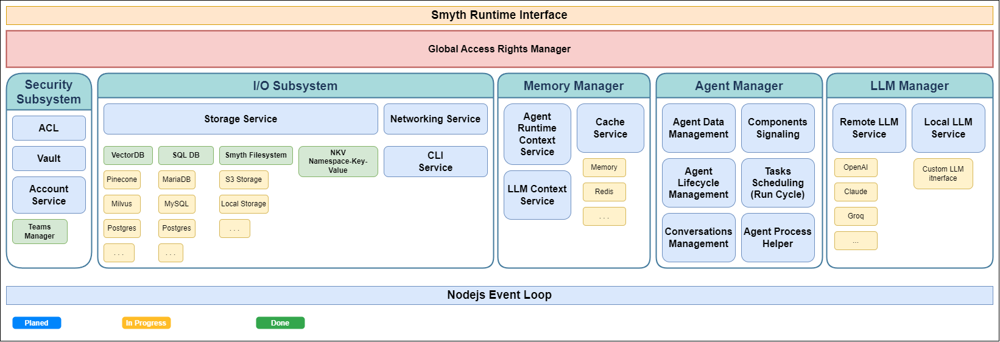

# 🚀 Smyth Runtime Environment (SRE) Overview

> **The Next-Generation AI Agent Runtime Platform**

## 🎯 What is SRE?

The Smyth Runtime Environment (SRE) is a sophisticated, production-ready runtime platform designed specifically for AI Agents. Think of it as the "Operating System for AI Agents" - a robust foundation that handles the complexities of AI agent execution, allowing developers to focus on building intelligent behaviors rather than infrastructure.

## 🏗️ Core Architecture Philosophy

SRE follows operating system kernel principles, providing a clean separation between **core runtime services** and **pluggable connectors**. This architecture ensures:

- **🔌 Modularity**: Every service is extensible through connector interfaces
- **🔒 Security**: Built-in access control with Candidate/ACL system
- **📊 Scalability**: Efficient resource management and isolation
- **🧩 Flexibility**: Swap implementations without touching core logic



## 🛡️ Security-First Design

Every operation in SRE requires proper authorization through the **Candidate/ACL system**:

```typescript
// Example: Agent requesting storage access
const candidate = AccessCandidate.agent(agentId);
const storage = ConnectorService.getStorageConnector().user(candidate);
await storage.write('data.json', content);
```

## 🏢 Subsystem Architecture

### 📥 IO Subsystem

_Your gateway to the outside world_

| Service      | Purpose                    | Connectors Available   |
| ------------ | -------------------------- | ---------------------- |
| **Storage**  | File & data persistence    | Local, S3, Smyth       |
| **VectorDB** | Vector storage & retrieval | Pinecone, SmythManaged |
| **Log**      | Activity & debug logging   | Console, Smyth         |
| **Router**   | HTTP API endpoints         | Express                |
| **NKV**      | Key-value storage          | Redis                  |
| **CLI**      | Command-line interface     | CLI                    |

```typescript
// Example: Using multiple storage connectors
const localStorage = ConnectorService.getConnector('Storage', 'Local');
const s3Storage = ConnectorService.getConnector('Storage', 'S3');
```

### 🧠 LLM Manager Subsystem

_Powering your AI capabilities_

- **🎯 Model Abstraction**: Unified interface for 8+ LLM providers
- **⚡ Smart Inference**: Optimized request routing and caching
- **📊 Usage Tracking**: Built-in token monitoring and analytics
- **🔧 Custom Models**: Support for custom model configurations

**Supported Providers:**

- OpenAI (GPT-4, GPT-3.5)
- Anthropic (Claude)
- Google AI (Gemini, Vertex AI)
- AWS Bedrock
- Groq, Perplexity, Hugging Face

```typescript
// Example: Multi-provider LLM usage
const openai = ConnectorService.getLLMConnector('OpenAI');
const claude = ConnectorService.getLLMConnector('Anthropic');
```

### 🛡️ Security Subsystem

_Trust, but verify_

- **🔐 Vault Services**: Secure credential storage (HashiCorp, AWS Secrets Manager, JSON File)
- **👤 Account Management**: Identity and authentication
- **🎫 Access Control**: Granular permission system
- **🔒 Managed Vault**: Enterprise-grade secret management

### 💾 Memory Manager Subsystem

_Intelligent state management_

- **⚡ Cache Service**: Multi-tier caching (RAM, Redis, S3, Local Storage)
- **🧠 Runtime Context**: Agent state and execution context
- **💭 LLM Context**: Conversation history and context management
- **📈 Resource Monitoring**: Memory usage tracking and optimization

### 🤖 Agent Manager Subsystem

_The heart of agent execution_

#### Agent Architecture

```
┌─────────────────┐
│  Agent Process  │ ← Your AI Agent
├─────────────────┤
│  Component A    │ ← LLM Call
├─────────────────┤
│  Component B    │ ← Data Processing
├─────────────────┤
│  Component C    │ ← External API
└─────────────────┘
```

**Key Features:**

- **🔄 Lifecycle Management**: Start, pause, resume, stop agents
- **📊 Real-time Monitoring**: Performance metrics and logging
- **🔀 Component Workflows**: Visual programming with 40+ components
- **🚀 Async Execution**: Non-blocking agent operations
- **📡 SSE Streaming**: Real-time updates to clients

## 🧩 Component System

SRE includes **40+ production-ready components** organized into categories:

### 🤖 AI & LLM Components

- `GenAILLM` - Multi-provider LLM integration
- `VisionLLM` - Image analysis and understanding
- `MultimodalLLM` - Text, image, and audio processing
- `LLMAssistant` - Conversational AI assistant
- `HuggingFace` - Hugging Face model integration
- `ImageGenerator` - AI image generation

### 🌐 External Integration

- `APICall` - HTTP API integration with OAuth support
- `WebSearch` - Web search capabilities
- `WebScrape` - Content extraction from websites
- `ZapierAction` - Zapier automation triggers
- `MCPClient` - Model Context Protocol client

### 📊 Data Processing

- `DataSourceIndexer` - Document indexing and processing
- `DataSourceLookup` - Information retrieval
- `DataSourceCleaner` - Data cleaning and normalization
- `JSONFilter` - JSON data manipulation
- `Classifier` - Content classification

### 🔧 Logic & Control Flow

- `LogicAND`, `LogicOR`, `LogicXOR` - Boolean operations
- `LogicAtLeast`, `LogicAtMost` - Conditional logic
- `ForEach` - Iteration and looping
- `Async`, `Await` - Asynchronous operation handling

### 💾 Storage & Files

- `FileStore` - File operations and management
- `Code` - Code execution and evaluation
- `ServerlessCode` - Serverless function execution

### 🖥️ System Integration

- `ComputerUse` - Computer automation and control
- `GPTPlugin` - OpenAI plugin integration
- `APIEndpoint` - Custom API endpoint creation

## 🎨 SDK: Simplified Development Experience

The **Smyth SDK** provides a streamlined, developer-friendly interface that abstracts away SRE's architectural complexity while preserving all its power. Think of it as the "express framework" for SRE - simple to use, yet built on a robust foundation.

### 🎯 Why Use the SDK?

**✅ Simplicity Without Sacrifice**

- Clean, intuitive API that's easy to learn
- No need to understand connector architecture
- Automatic configuration and setup
- Type-safe development with full IntelliSense

**🔧 Production-Ready Scalability**

- SDK is an abstraction layer **over** SRE, not separate from it
- Start with development defaults, scale to production seamlessly
- Business logic stays unchanged while infrastructure evolves
- Strong separation between your code and system management

### 🚀 Quick Start with SDK

```typescript
import { SRE, SDK } from 'smyth-runtime';

// 1. Initialize SRE (one-time setup)
const sre = SRE.init({
    Cache: { Connector: 'RAM' },
    Storage: { Connector: 'Local' },
    Log: { Connector: 'ConsoleLog' },
});
await sre.ready();

// 2. Create an LLM with simple API
const llm = new SDK.LLM('OpenAI', {
    model: 'gpt-4',
    temperature: 0.7,
});

// 3. Instant AI responses
const response = await llm.prompt('Explain quantum computing');
console.log(response);

// 4. Streaming responses
const stream = await llm.prompt('Write a story').stream();
stream.on('content', (chunk) => process.stdout.write(chunk));
```

### 🤖 Agent Creation Made Simple

```typescript
// Create an intelligent agent
const agent = new SDK.Agent({
    name: 'DataAnalyst',
    model: 'gpt-4',
    behavior: 'You are an expert data analyst who provides insights from data.',
});

// Add custom skills to your agent
const dataProcessor = agent.addSkill({
    name: 'processData',
    description: 'Analyze and process data',
    process: async (data) => {
        // Your custom logic here
        return { analysis: 'processed', insights: [] };
    },
});

// Use your agent
const result = await agent.prompt('Analyze the sales data for trends');
```

### 🧩 Programmatic Component Composition

The SDK provides type-safe wrappers for all 40+ SRE components:

```typescript
import { SDK } from 'smyth-runtime';

// Create components programmatically
const llm = SDK.GenAILLM(
    {
        model: 'gpt-4',
        prompt: 'Analyze this text',
        temperature: 0.3,
    },
    agent,
);

const classifier = SDK.Classifier(
    {
        classes: ['positive', 'negative', 'neutral'],
    },
    agent,
);

const webSearch = SDK.WebSearch(
    {
        query: 'latest AI news',
        maxResults: 5,
    },
    agent,
);

// Connect components with fluent API
classifier.in({
    Input: llm.out.Reply,
});

webSearch.in({
    query: classifier.out.Result,
});
```

### 🎯 SDK Component Categories

The SDK automatically generates type-safe wrappers for all SRE components:

| Category        | SDK Components                                           |
| --------------- | -------------------------------------------------------- |
| **🤖 AI/LLM**   | `GenAILLM`, `VisionLLM`, `MultimodalLLM`, `LLMAssistant` |
| **🌐 External** | `APICall`, `WebSearch`, `WebScrape`, `ZapierAction`      |
| **📊 Data**     | `DataSourceIndexer`, `DataSourceLookup`, `JSONFilter`    |
| **🔧 Logic**    | `LogicAND`, `LogicOR`, `Classifier`, `ForEach`           |
| **💾 Storage**  | `FileStore`, `Code`, `ServerlessCode`                    |

### 🛠️ Custom Skills & Extensions

Create reusable skills that integrate seamlessly with your agents:

```typescript
// Define a custom skill
const weatherSkill = agent.addSkill({
    name: 'getWeather',
    description: 'Get current weather for a location',
    ai_exposed: true, // Available to LLM as a tool
    process: async (location) => {
        // Your weather API logic
        return { temperature: 72, condition: 'sunny' };
    },
});

// Agent automatically uses it as a tool
const response = await agent.prompt("What's the weather in Paris?");
// Agent will automatically call your weather skill!
```

### 🔗 Conversation Management

```typescript
// Create persistent conversations
const chat = agent.chat();

// Multi-turn conversation with context
await chat.send('Hello, I need help with data analysis');
await chat.send('Can you analyze this CSV file?');
await chat.send('What trends do you see?');

// Access full conversation history
console.log(chat.history);
```

### 🚀 Development to Production Evolution

The SDK's power lies in **configuration independence** - your business logic code stays identical while the underlying SRE infrastructure scales from development to enterprise production:

#### 📝 Development Configuration (SDK Defaults)

```typescript
// Simple setup - great for development and prototyping
const sre = SRE.init({
    Cache: { Connector: 'RAM' }, // In-memory caching
    Storage: { Connector: 'Local' }, // Local filesystem
    Account: { Connector: 'DummyAccount' }, // No authentication
    Log: { Connector: 'ConsoleLog' }, // Console output
});

// Your business logic with SDK
const agent = new SDK.Agent({ name: 'MyAgent', model: 'gpt-4' });
const result = await agent.prompt('Process this data');
```

#### 🏢 Production Configuration (Zero Code Changes)

```typescript
// Enterprise setup - same business logic, production infrastructure
const sre = SRE.init({
    Cache: {
        Connector: 'Redis',
        Settings: {
            url: 'redis://prod-cluster.cache.amazonaws.com:6379',
            maxMemory: '10gb',
        },
    },
    Storage: {
        Connector: 'S3',
        Settings: {
            bucket: 'company-ai-agents',
            region: 'us-east-1',
        },
    },
    Account: {
        Connector: 'JSONFileAccount', // or your custom enterprise auth
        Settings: {
            file: '/secure/accounts.json',
            encryption: true,
        },
    },
    Vault: {
        Connector: 'HashicorpVault',
        Settings: {
            url: 'https://vault.company.com',
            token: process.env.VAULT_TOKEN,
        },
    },
    Log: {
        Connector: 'SmythLog',
        Settings: {
            level: 'info',
            structured: true,
            destination: 'elasticsearch',
        },
    },
});

// IDENTICAL business logic - zero changes needed!
const agent = new SDK.Agent({ name: 'MyAgent', model: 'gpt-4' });
const result = await agent.prompt('Process this data');
```

#### 🎯 Configuration Evolution Benefits

| Aspect             | Development Default | Production Upgrade       | Business Logic Impact |
| ------------------ | ------------------- | ------------------------ | --------------------- |
| **Caching**        | RAM (limited)       | Redis Cluster (scalable) | ✅ **No changes**     |
| **Storage**        | Local filesystem    | S3/Enterprise storage    | ✅ **No changes**     |
| **Authentication** | Dummy (no auth)     | Enterprise SSO/LDAP      | ✅ **No changes**     |
| **Monitoring**     | Console logs        | Structured logging/APM   | ✅ **No changes**     |
| **Secrets**        | Environment vars    | HashiCorp Vault          | ✅ **No changes**     |
| **Access Control** | Open access         | Role-based permissions   | ✅ **No changes**     |

**🎯 The Result**: Your AI agent logic remains **completely unchanged** while gaining enterprise-grade security, scalability, and observability.

## 🎪 Hybrid Development: Visual + Code

The beauty of SRE's architecture is that you can **combine both approaches**:

**🎨 Visual Designer** - Perfect for:

- Rapid prototyping
- Complex workflow visualization
- Business logic design
- Non-technical stakeholders

**💻 SDK Programming** - Ideal for:

- Version control and CI/CD
- Custom business logic
- Automated testing
- Developer-centric workflows

```typescript
// Start with SDK, enhance with visual designer
const agent = new SDK.Agent({ name: 'HybridAgent', model: 'gpt-4' });

// Export to visual designer for workflow design
const agentData = agent.data;

// Import back enhanced workflows from visual designer
// Your code keeps working seamlessly!
```

## 🚀 Boot Process & Initialization

```typescript
// 1. Initialize Runtime
const sre = SRE.init({
    Storage: { Connector: 'S3', Settings: { bucket: 'my-bucket' } },
    Cache: { Connector: 'Redis', Settings: { url: 'redis://localhost' } },
    LLM: { Connector: 'OpenAI', Settings: { apiKey: 'sk-...' } },
    Vault: { Connector: 'HashicorpVault', Settings: { url: 'https://vault.company.com' } },
});

// 2. Wait for ready state
await sre.ready();

// 3. Create and run agent
const agent = new Agent(agentData, settings);
const result = await agent.process('/start', inputData);
```

**SRE Boot Sequence:**

1. 🚀 **Boot sequence initialization**
2. 🔐 **Security & Core Infrastructure Setup**
    - Vault connector (credential storage)
    - Account connector (authentication)
    - Cache connector (memory management)
    - Storage connector (file persistence)
3. 🧠 **AI Infrastructure Initialization**
    - VectorDB connector (embeddings storage)
    - Models provider connector (AI model access)
4. 📊 **Agent Management Setup**
    - Agent data connector (agent persistence)
    - Component registration (40+ components loaded)
5. ✅ **SRE Core Initialized**
6. 🤖 **LLM Provider Connections**
    - Multiple LLM connectors based on configuration
    - Provider-specific authentication and setup
7. 🌐 **API & Routing Setup**
    - HTTP router configuration
    - Endpoint registration
8. 🎯 **Boot sequence completed** - System ready for agents

## 💡 Developer Experience

### 🎨 Dual Creation Modes

SRE offers **two powerful ways** to build AI agents, and you can seamlessly switch between them:

**🖼️ Visual Designer Approach**
Agents are built using an intuitive visual workflow editor where components connect through input/output ports:

```json
{
    "connections": [
        {
            "sourceId": "llm_1",
            "targetId": "classifier_1",
            "sourceIndex": 0,
            "targetIndex": 0
        }
    ]
}
```

**💻 Programmatic SDK Approach**
Create the same workflows with code using the type-safe SDK:

```typescript
const llm = SDK.GenAILLM({ model: 'gpt-4' }, agent);
const classifier = SDK.Classifier({ classes: ['positive', 'negative'] }, agent);

// Connect components programmatically
classifier.in({ Input: llm.out.Reply });
```

### 📊 Real-time Monitoring

- **SSE Streaming**: Live updates during agent execution
- **Component Logging**: Detailed execution traces
- **Performance Metrics**: Resource usage and timing
- **Debug Mode**: Step-by-step execution analysis

### 🔧 Extensibility

Create custom components by extending the base `Component` class:

```typescript
export class MyCustomComponent extends Component {
    async process(input, config, agent) {
        // Your custom logic here
        return { result: processedData };
    }
}
```

## 🌟 Production Features

### 📈 Scalability

- **Resource Monitoring**: OS-level resource tracking
- **Forked Agents**: Spawn child agent processes
- **Load Balancing**: Distribute work across instances
- **Caching**: Multi-tier caching for performance

### 🔐 Enterprise Security

- **Vault Integration**: HashiCorp Vault, AWS Secrets Manager
- **Access Control**: Role-based permissions
- **Audit Logging**: Complete operation tracking
- **Secure Transport**: TLS/SSL everywhere

### 🏗️ DevOps Ready

- **TypeScript**: Full type safety
- **Testing**: Comprehensive test suite with Vitest
- **Monitoring**: Built-in observability
- **Docker**: Container-ready deployment

## 🚀 Getting Started

```bash
npm install smyth-runtime
```

```typescript
import { SRE, SDK } from 'smyth-runtime';

// Initialize with minimal config
const sre = SRE.init({
    Cache: { Connector: 'RAM' },
    Storage: { Connector: 'Local' },
    Log: { Connector: 'ConsoleLog' },
});

await sre.ready();

// Create an LLM instance
const llm = new SDK.LLM('OpenAI', { model: 'gpt-4' });

// Stream responses
const eventEmitter = await llm.prompt('Hello, world!').stream();
eventEmitter.on('content', console.log);
```

## 🔮 What Makes SRE Special?

1. **🎯 Purpose-Built**: Designed specifically for AI agent workloads
2. **🔒 Security-First**: Enterprise-grade security from day one
3. **⚡ Performance**: Optimized for high-throughput AI operations
4. **🧩 Modular**: Swap any component without breaking the system
5. **📊 Observable**: Built-in monitoring and debugging tools
6. **🌍 Cloud-Native**: Runs anywhere - local, cloud, or edge

---

_Ready to build the next generation of AI agents? Start with SRE and focus on what matters - the intelligence, not the infrastructure._
